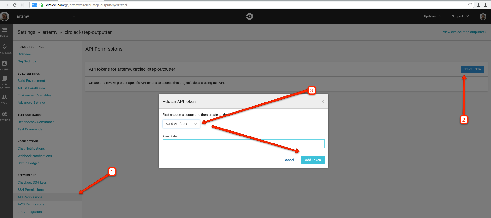

# circle-step-outputter 
[](https://greenkeeper.io/)
[](https://travis-ci.org/artemv/circleci-step-outputter)

Writes CircleCI step output to a file


## Install

```
$ npm install --global circle-step-outputter
```


## Usage

## CLI

```
$ circle-step-outputter --help

  Writes CircleCI build step output to a file

  Usage
    $ circle-step-outputter [options]

  Options
    --baseFileName [Default: "test-output"]
    --repoSlug [Default: $CIRCLE_PROJECT_USERNAME/$CIRCLE_PROJECT_REPONAME]
    --buildNum [Default: $CIRCLE_BUILD_NUM]
    --token [Default: $CIRCLE_API_TOKEN]
    --step [Default: "npm test"] - a build step name substring

  Examples
    $ circle-step-outputter --repoSlug="artemv/circleci-step-outputter" --buildNum=2
  This will write test-output.json, or test-output0.txt, test-output1.txt ... test-output4.txt if there are
  multiple actions in the step (usually parallel actions).
```
For public/open source projects specifying `token` is not needed - you only need to do it for private projects. You can 
generate the token here: 

## API

```js
const circleStepOutputter = require('circle-step-outputter');

circleStepOutputter({repoSlug: "artemv/circleci-step-outputter", buildNum: 2});
```

### circleStepOutputter([options])

#### options

Type: `Object`

See CLI section for options list.

## License

MIT © [Artem Vasiliev](https://github.com/artemv)
